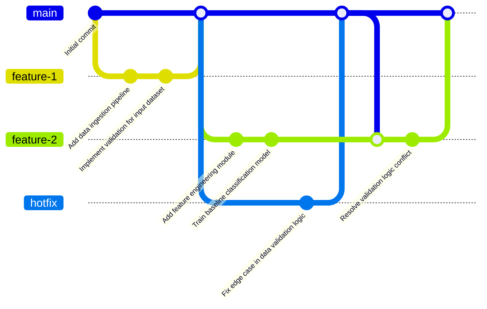

## Contributing

### Quick Links

- 📋 [Initial Ethics Scan Form](https://forms.office.com/Pages/ResponsePage.aspx?id=KEeHxuZx_kGp4S6MNndq2BVHD6pyd0hHqgn8qzKRvG5UQVMyR0ZYUDQ2SUg2VjJGSzZFUEhKSDYzTC4u)
- 🏠 [MoJ AI & Data Ethics Hub on SharePoint](https://justiceuk.sharepoint.com/sites/MoJAIDataEthicsHub)
- 📚 [Case Study Library](https://justiceuk.sharepoint.com/sites/MoJAIDataEthicsHub/SitePages/Case-Study-Library(1).aspx)
- 📘 [Full Framework Documentation](https://www.gov.uk/government/publications/ministry-of-justice-ai-and-data-science-ethics-framework)
- 🏛️ [UK Government Data Ethics Framework](https://www.gov.uk/government/publications/data-ethics-framework)
- 📖 [MoJ Data Science and AI Playbook](https://justiceuk.sharepoint.com/:x:/s/DataEngineeringDataScience/IQBDMxjlHr8lS7_RCPgEvjuIASQy37cBpga9N6B3nGMsyEw?e=dRsrNw)

### How to Contribute

We welcome contributions and suggestions! Here's how you can help:

1. **Report Issues**: Found a bug or have a feature request? [Open an issue](https://github.com/moj-analytical-services/data-science-template/issues/new/choose)

2. **Suggest Improvements**: Have ideas for improving this template? Create an issue with the "enhancement" label

3. **Submit Pull Requests**:
   - Fork the repository
   - Create a feature branch (`git checkout -b feature/improvement`)
   - Make your changes and commit (`git commit -am 'Add new feature'`)
   - Push to the branch (`git push origin feature/improvement`)
   - Open a Pull Request

4. **Document Decisions**: For significant architectural changes, create an [Architecture Decision Record](docs/adr/README.md) using:

   ```bash
   adr-new "Your decision title"
   ```

#### GitHub Flow



We promote using [GitHub flow](https://guides.github.com/introduction/flow/) for all contributions to ensure a smooth and collaborative development process without too much administrative overhead.

Other git workflows (like Gitflow) can be used for larger projects requirirng governance.

- [GitFlow](https://www.atlassian.com/git/tutorials/comparing-workflows/gitflow-workflow) - A more structured workflow with separate branches for features, releases, and hotfixes. Suitable for larger projects with multiple contributors and a need for clear release management.
- [GitLab Flow](https://about.gitlab.com/topics/version-control/what-is-gitlab-flow/) - Combines feature-driven development with CI/CD. Ideal for teams with a focus on long term support for releases.

If you do decide to use a different workflow, creating an ADR to document the rationale and process is recommended to ensure clarity and consistency across the team and future contributors.

### Filling in the Playbook

The purpose of the [MoJ Data Science and AI Playbook](https://justiceuk.sharepoint.com/:x:/s/DataEngineeringDataScience/IQBDMxjlHr8lS7_RCPgEvjuIASQy37cBpga9N6B3nGMsyEw?e=dRsrNw) is to document and prompt the different stages of a data science project, including completing the AI & Data Science Ethics Framework process.

You should consult this playbook as you go through your project.

### Working with the AI & Data Science Ethics Framework

> [!CAUTION]
> **DO THIS FIRST**: Before writing any code or collecting any data, conduct an initial ethics scan. This is a quick assessment to identify potential ethical issues early when they're easiest to address.
>
> **Use the official ethics scan questionnaire**: [MoJ Ethics Scan Questions Form](https://forms.office.com/Pages/ResponsePage.aspx?id=KEeHxuZx_kGp4S6MNndq2BVHD6pyd0hHqgn8qzKRvG5UQVMyR0ZYUDQ2SUg2VjJGSzZFUEhKSDYzTC4u) - This form guides you through the initial assessment questions.

> [!IMPORTANT]
> **MANDATORY REQUIREMENT**: All data science and AI projects **must** follow the [MoJ Data Ethics Framework process](https://justiceuk.sharepoint.com/sites/MoJAIDataEthicsHub/SitePages/Governance-Process.aspx?csf=1&web=1&e=GrR7F5)
>
> **Projects cannot proceed to deployment without:**
> - Completed Development Phase Questionnaire
> - Completed Deployment Phase Questionnaire
> - Final ethics sense check approval

**Required Documentation:**

You **must** create and maintain the following:
- Decision log recording all ethical considerations and choices
- Stakeholder engagement records for each project phase
- Completed Development Phase Questionnaire before model finalisation
- Completed Deployment Phase Questionnaire before system deployment
- Final ethics sense check sign-off
- Documentation of how each SAFE-D principle applies to your project

The framework follows a **Project Lifecycle Model** with three phases:

##### 1. Design Phase
**Start immediately at project inception**

**Key Activities:**
- **Initial Ethics Scan** (MANDATORY FIRST STEP)
- SAFE-D Identification Workshop Exercise
- Litmus Test
- Stakeholder Engagement Worksheet
- Additional activities where relevant

##### 2. Development Phase
**Key Activities:**
- SAFE-D Reflection Workshop Exercise
- **Development Phase Questionnaire** (required)
- Stakeholder Engagement Worksheet
- Additional activities where relevant

> [!WARNING]
> **MANDATORY: You must complete all phase questionnaires and conduct a final ethics sense check before deployment.** Projects cannot proceed to deployment without completed Development and Deployment Phase Questionnaires. These are not suggestions—they are required checkpoints to ensure SAFE-D principles have been properly considered and documented.
